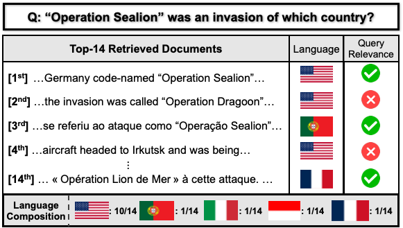

<div align="center">

# SHIFT

### Semantic Harmonization via Index-side Feature Transformation for Multilingual Information Retrieval

[](https://2026.emnlp.org/)
[](https://arxiv.org/abs/2606.18801)
[](LICENSE)
[](https://www.python.org/)
[](https://huggingface.co/datasets/yjoonjang/mlir-benchmarks)



<b>Official implementation of the <a href="https://2026.emnlp.org/">Findings of EMNLP 2026</a> paper.</b>

</div>

---

## News

- **2026-08** · Accepted to **Findings of EMNLP 2026**. Code, pre-computed language vectors, and the [MLIR benchmarks](https://huggingface.co/datasets/yjoonjang/mlir-benchmarks) are public.
- **2026-06** · Paper released on [arXiv](https://arxiv.org/abs/2606.18801).

## Overview

Multilingual dense retrievers exhibit strong **language bias**: given a query, documents in the query's language dominate the top ranks even when equally relevant documents exist in other languages. SHIFT is a **training-free, index-side** correction:

1. **Estimate** a relative language vector for each target language from aligned mMARCO translation pairs (Eq. 1): `V_l = mean( f(D_tgt) − f(D_src) )`
2. **Shift** each document embedding at indexing time: `z̃ = z − α · V_l` for documents not in the source language (Algorithm 1)
3. **Retrieve** as usual — queries are untouched, so SHIFT adds **zero query-time latency**

The paper also introduces **TLR@k (Target-Languages Recall@k)**, which measures recall restricted to relevant documents written in languages other than the query's.

## Installation

Requires Python ≥ 3.10 and [uv](https://docs.astral.sh/uv/).

```bash
git clone https://github.com/yjoonjang/SHIFT.git
cd SHIFT
uv sync

uv sync --extra neuclir   # optional: NeuCLIR evaluation (Appendix F)
uv sync --extra lid       # optional: FastText LID robustness (Appendix G)
```

## Data preparation

```bash
# Aligned mMARCO passage pairs (533k rows x 14 languages) for vector estimation
uv run python scripts/prepare_data/prepare_mmarco_pairs.py --output_dir data/mmarco_pairs

# (optional) rebuild the MLIR benchmarks from the original sources —
# evaluation downloads the released ones from the HF Hub automatically
uv run python scripts/prepare_data/build_benchmarks.py --output_dir data/benchmarks
uv run python scripts/prepare_data/build_benchmarks.py --output_dir data/benchmarks --query_lang zh
uv run python scripts/prepare_data/build_benchmarks.py --output_dir data/benchmarks --multilingual_queries
```

The evaluation benchmarks used in the paper (English + zh/vi/hi source variants, and the multilingual-query variant) are released at [yjoonjang/mlir-benchmarks](https://huggingface.co/datasets/yjoonjang/mlir-benchmarks) and downloaded automatically at evaluation time; a local `data/benchmarks` or `--data_dir` takes precedence. The mMARCO pairs above are only needed to estimate language vectors for a new retriever (pre-computed vectors ship in `lang_vectors/`).

## Usage

Pre-computed language vectors for the six retrievers evaluated in the paper
(English plus zh/vi/hi source languages, ~70KB each) ship in [`lang_vectors/`](lang_vectors/),
so step 1 below is only needed for a new retriever or source language.

```bash
# 1. Estimate relative language vectors for a retriever (one-time per model)
uv run python scripts/compute_lang_vectors.py \
    --model intfloat/multilingual-e5-large --pairs_data data/mmarco_pairs

# 2. Evaluate Base vs SHIFT (nDCG@20, Recall@20, TLR@20); alphas share one encoding pass
uv run python scripts/evaluate.py --model intfloat/multilingual-e5-large --alphas 0.6
uv run python scripts/evaluate.py --model BAAI/bge-m3 --alphas 0.1 0.2 0.3 0.4 0.5 0.6 0.7 0.8 0.9 1.0

# Everything in Tables 2 & 3 (6 retrievers x alpha grid):
bash scripts/run_main_results.sh
```

Applying SHIFT in your own code is a few lines:

```python
from shift.langvec import load_language_vectors
from shift.apply import apply_language_shift

vectors = load_language_vectors("lang_vectors/intfloat_multilingual-e5-large_lang_vectors_src-en.pt")
shifted = apply_language_shift(doc_embeddings, doc_langs, vectors, alpha=0.6, source_lang="en")
# index `shifted` instead of `doc_embeddings`; queries need no change
```

### Additional experiments

```bash
# Non-English source languages (Section 5.3): re-estimate vectors per source language
uv run python scripts/compute_lang_vectors.py --model BAAI/bge-m3 --pairs_data data/mmarco_pairs --source_lang zh
uv run python scripts/evaluate.py --model BAAI/bge-m3 --alphas 1.0 --query_lang zh

# Post-hoc debiasing baselines (Appendix C): language-wise Centering and LIR
uv run python scripts/evaluate_baselines.py --model BAAI/bge-m3 --method centering --pairs_data data/mmarco_pairs
uv run python scripts/evaluate_baselines.py --model BAAI/bge-m3 --method lir --pairs_data data/mmarco_pairs

# NeuCLIR 2023 (Appendix F)
uv run python scripts/evaluate_neuclir.py --model intfloat/multilingual-e5-large --alpha 0.6
```

## Project structure

```
├── src/shift/
│   ├── models.py        # retriever loading + query/document prefix registry (Table 5)
│   ├── langvec.py       # relative language vector estimation (Eq. 1)
│   ├── apply.py         # index-side shift (Algorithm 1) + document language inference
│   ├── metrics.py       # TLR@k
│   ├── data.py          # benchmark loading (local or HF Hub)
│   └── baselines/       # language-wise Centering, LIR (Appendix C)
├── scripts/
│   ├── prepare_data/    # mMARCO pairs + MLIR benchmark construction
│   ├── compute_lang_vectors.py
│   ├── evaluate.py      # Base vs SHIFT, alpha sweeps, TLR
│   ├── evaluate_baselines.py
│   ├── evaluate_neuclir.py
│   └── run_main_results.sh
└── tests/
```

## Citation

```bibtex
@inproceedings{jang2026shift,
  title     = {{SHIFT}: Semantic Harmonization via Index-side Feature Transformation for Multilingual Information Retrieval},
  author    = {Jang, Youngjoon and Hong, Seongtae and Moon, Hyeonseok and Lim, Heuiseok},
  booktitle = {Findings of the Association for Computational Linguistics: EMNLP 2026},
  year      = {2026},
  url       = {https://arxiv.org/abs/2606.18801}
}
```

## License

[MIT](LICENSE)
